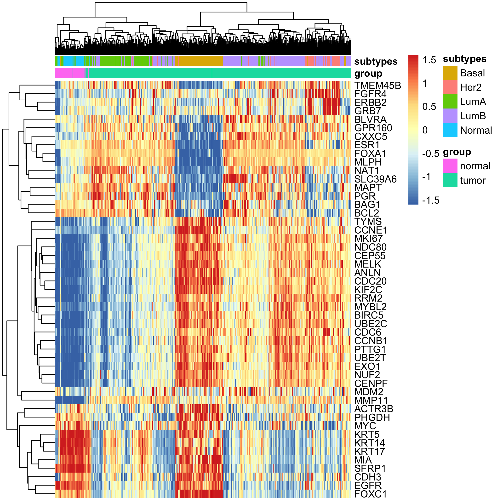
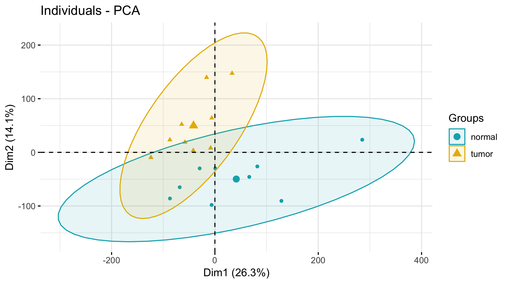

# TCGA_BRCA数据挖掘测试

首先在UCSC Xena数据库下载TCGA计划的所有BRCA相关数据分析结果来进行下游挖掘。

UCSC Xena网址：  <https://xenabrowser.net/datapages/> 

我这里选择的是TCGA Breast Cancer (BRCA) (30 datasets) 而不是  GDC TCGA Breast Cancer (BRCA) (18 datasets)  一定要搞清楚哦！！！

### 下载的数据包括：

- [AgilentG4502A_07_3](https://xenabrowser.net/datapages/?dataset=TCGA.BRCA.sampleMap%2FAgilentG4502A_07_3&host=https%3A%2F%2Ftcga.xenahubs.net&removeHub=https%3A%2F%2Fxena.treehouse.gi.ucsc.edu%3A443) (n=597) TCGA hub
- [IlluminaHiSeq](https://xenabrowser.net/datapages/?dataset=TCGA.BRCA.sampleMap%2FHiSeqV2_exon&host=https%3A%2F%2Ftcga.xenahubs.net&removeHub=https%3A%2F%2Fxena.treehouse.gi.ucsc.edu%3A443) (n=1,218) TCGA hub
- [gistic2 thresholded](https://xenabrowser.net/datapages/?dataset=TCGA.BRCA.sampleMap%2FGistic2_CopyNumber_Gistic2_all_thresholded.by_genes&host=https%3A%2F%2Ftcga.xenahubs.net&removeHub=https%3A%2F%2Fxena.treehouse.gi.ucsc.edu%3A443) (n=1,080) TCGA hub
- [Phenotypes](https://xenabrowser.net/datapages/?dataset=TCGA.BRCA.sampleMap%2FBRCA_clinicalMatrix&host=https%3A%2F%2Ftcga.xenahubs.net&removeHub=https%3A%2F%2Fxena.treehouse.gi.ucsc.edu%3A443) (n=1,247) TCGA hub

### 首先对芯片表达矩阵分析

这里仅仅是跑了PAM50分类，结果如下：



如果你感兴趣其它分析，可以看我安排给2018年学徒的数据挖掘任务，比如下载乳腺癌的芯片表达数据进行差异分析  https://mp.weixin.qq.com/s/CJb27qhbjdZadJDnK2vNLw  

### 然后是针对RNA-seq表达矩阵的

因为GitHub容量限制，我仅仅是挑选了TNBC的病人，代码如下：

```r
rm(list = ls())
options(stringsAsFactors = F)
a=read.table('TCGA-BRCA.survival.tsv.gz',header = T,sep = '\t')
a=read.table('TCGA-BRCA.GDC_phenotype.tsv.gz',header = T,sep = '\t',quote = '')
(tmp=as.data.frame(colnames(a)))
tmp=a[,grepl('her2',colnames(a))]
table(a$breast_carcinoma_estrogen_receptor_status)
table(a$breast_carcinoma_progesterone_receptor_status)
table(a$lab_proc_her2_neu_immunohistochemistry_receptor_status)
eph=a[,grepl('receptor_status',colnames(a))]
eph=eph[,1:3]
## 挑选全部是阴性的
tnbc_s=a[apply(eph,1, function(x) sum(x=='Negative'))==3,1]
tnbc_s
save(tnbc_s,file = 'tnbc_s.Rdata')
```

然后在TNBC病人里面挑选那些既有normal又有tumor的样本，这样就只有9个TNBC病人了，他们的表达矩阵的主成分分析如下：



可以看到，normal和tumor在RNA-seq的表达水平上泾渭分明，就可以做差异分析流程啦，代码见：TCGA数据库中三阴性乳腺癌在亚洲人群中的差异表达  ， https://mp.weixin.qq.com/s/IOGfzzpcWkzyQPzMADKY4g 

当然了，针对这么大的数据量，你可以任意开启自己的课题，比如我安排给2018年学徒的：

- 有PIK3CA基因突变的肿瘤病人的转录水平变化 https://mp.weixin.qq.com/s/MJLEZPWqzJe4LaKRDtiZQQ **从986个样本中挑出了327个有PIK3CA突变的样本**，但是呢，**同一个病人既有正常样本，又有肿瘤样本的表达信息** ，符合要求的样本就**只有35个**了 
- TP53突变型和TP53野生型BRCA病人的差异分析结果  https://mp.weixin.qq.com/s/Phu-MxA0d079HdtBWTHbWg 而且还有参考文章 https://www.biorxiv.org/content/10.1101/354779v1 可以比较容易把自己的代码跟已经发表的研究进行比较，发现 immune gene-sets had significantly higher enrichment levels in *TP53*-mutated BCs compared to *TP53*-wildtype BCs。

### somatic 突变分析


### CNV分析


### 临床资料分析


