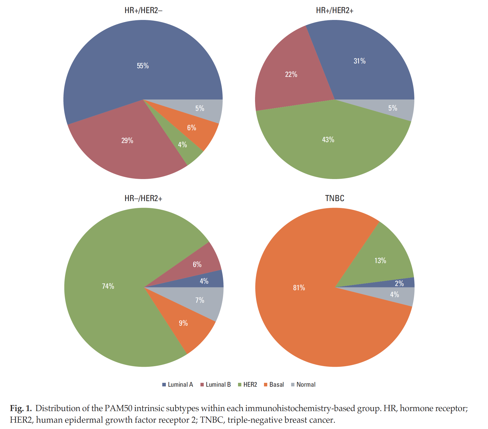
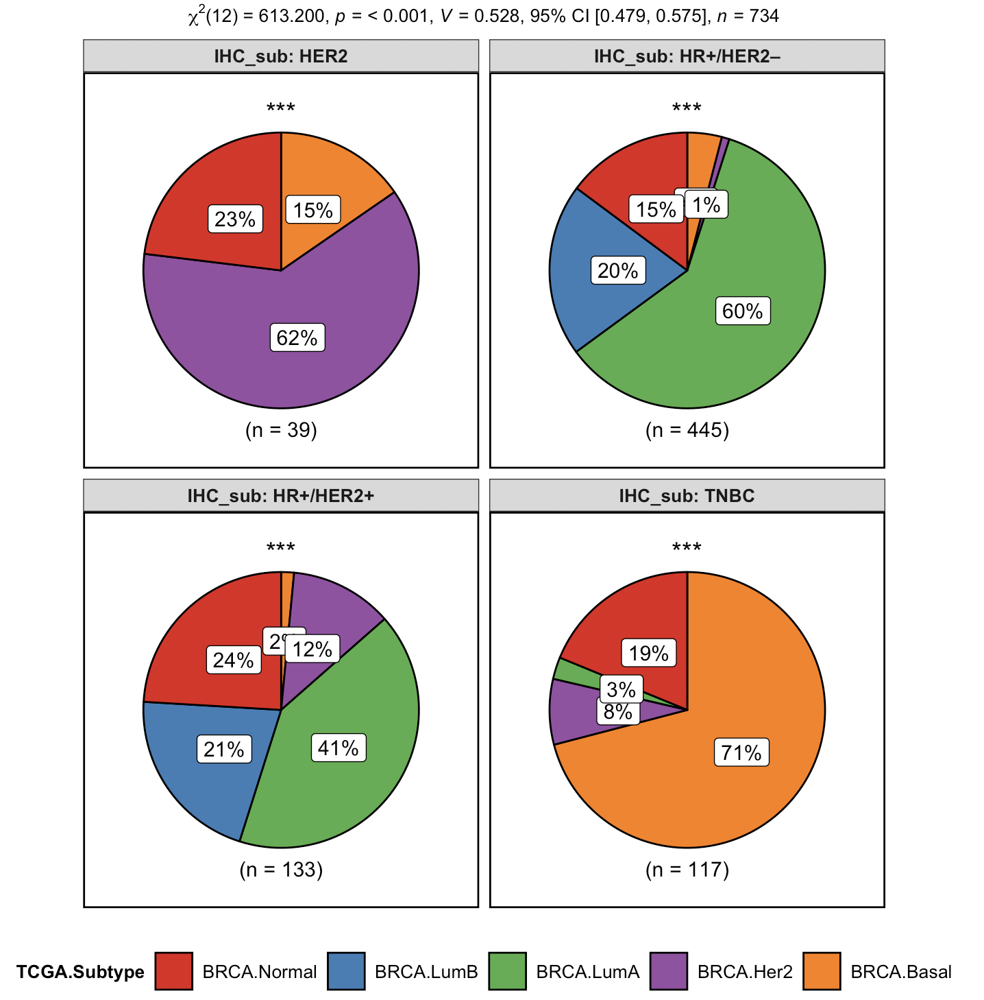

通过全基因表达谱可以区分浸润性乳腺癌（IBCS）的5个独特亚型： Luminal A、Luminal B、正常乳腺样，HER2基因过表达、基底细胞样，每个亚型各自具有独特的发病率、生存率和疗效。

不过大部分情况下，并没有病人的全基因表达谱，因此许多学者研究采用免疫组织化学发（IHC）作为确定浸润性乳腺癌分子分型的替代方法。

最常用的IHC替代方案是雌激素受体（ER）、孕激素受体（PR）和人类表皮生长因子受体（HER2），将乳腺癌区分成为4类：

- HR+  HER2- 
- HR+ HER2+
- HR- HER2+
- TNBC

我看到文章Cancer Res Treat. 2019;51(2):737-747，https://doi.org/10.4143/crt.2018.342 提到他们研究团队把HR+/HER2–, HR+/ HER2+, HR–/HER2+, and triple-negative breast cancer (TNBC) 这4类，跟 PAM50的5类进行比较，如下；



所以我们也可以对自己下载的TCGA的BRCA研究进行同样的处理。

### 首先解析XENA数据库下载的临床资料

这个可以去看我的TCGA28篇教程或者配套的B站视频：https://www.bilibili.com/video/av49363776 

```r
rm(list = ls())
options(stringsAsFactors = F) 
a=read.table('TCGA-BRCA.GDC_phenotype.tsv.gz',header = T,sep = '\t',quote = '')
(tmp=as.data.frame(colnames(a))) 
table(a$breast_carcinoma_estrogen_receptor_status)
table(a$breast_carcinoma_progesterone_receptor_status)
table(a$lab_proc_her2_neu_immunohistochemistry_receptor_status)
```

然后在2018年4月Immunity杂志上发表了文章[The Immune Landscape of Cancer](https://www.sciencedirect.com/science/article/pii/S1074761318301213) 附件拿到TCGA的BRCA的PAM50分型信息。

```r
b=read.table('TCGA-PAM50-subtype.txt',sep = '\t',header = T)
table(b$TCGA.Subtype)
```

两种信息如下：

```
> table(a$breast_carcinoma_estrogen_receptor_status)

              Indeterminate      Negative      Positive 
          196             3           249           835 
> table(a$breast_carcinoma_progesterone_receptor_status)

              Indeterminate      Negative      Positive 
          198             5           357           723 
> table(a$lab_proc_her2_neu_immunohistochemistry_receptor_status)

                  Equivocal Indeterminate      Negative      Positive 
          346           170            11           577           179 
> table(b$TCGA.Subtype)

 BRCA.Basal   BRCA.Her2   BRCA.LumA   BRCA.LumB BRCA.Normal 
        173          73         508         191         139 
```

这个时候需要构建IHC分型和PAM50分子分型的比较矩阵。

```r
# 首先简化列名
dat=data.frame(id=a$submitter_id,
               er=a$breast_carcinoma_estrogen_receptor_status,
               pr=a$breast_carcinoma_progesterone_receptor_status,
               her2=a$lab_proc_her2_neu_immunohistochemistry_receptor_status)
dat =dat[with(dat,er %in% c('Negative','Positive')) &
with(dat,pr %in% c('Negative','Positive')) &
with(dat,her2 %in% c('Negative','Positive')),]
table(dat)
# 过滤不确定的IHC信号后， 剩下 747个病人。
# 判断临床亚型
# er或pr为+，且her为+，则IHC_sub为B
# er或pr为+，且her为-，则IHC_sub为A
# er、pr都为-，且her为+，则IHC_sub为HER2过表达
# er、pr、her都为-，则IHC_sub为TNBC
dat$IHC_sub[(dat$er=='Positive' | dat$pr=='Positive') & dat$her2=='Negative'] = 'HR+/HER2–'
dat$IHC_sub[(dat$er=='Positive' | dat$pr=='Positive') & dat$her2=='Positive'] = 'HR+/HER2+'
dat$IHC_sub[(dat$er=='Negative' & dat$pr=='Negative') & dat$her2=='Positive'] = 'HER2'
dat$IHC_sub[(dat$er=='Negative' & dat$pr=='Negative') & dat$her2=='Negative'] = 'TNBC'
table(dat$IHC_sub)
d=merge(dat,b,by.x='id',by.y="TCGA.Participant.Barcode")
```

画图，用的是`ggstatsplot`包的`ggpiestats`，要求数据类型为factor，所以通过`pam50`构造了一列`subtype`

```d
colnames(d)
library(ggstatsplot) 
ggpiestats(data = d,
           main = TCGA.Subtype,
           condition = IHC_sub,
           palette = "Set1"
)

```

出图如下；

